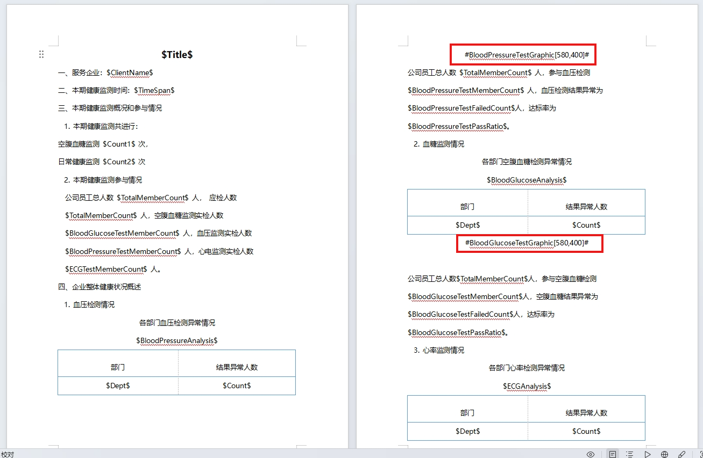
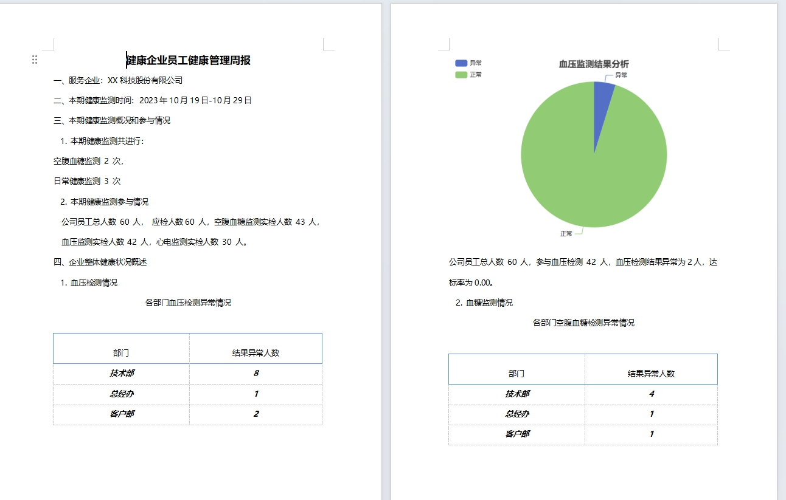

# EChartsGen_DocTemplateTool_Sample


## 生成Word文档

使用[Document Template Tool](https://github.com/jevonsflash/DocTemplateTool)，通过指定ChartOption对象，生成图片。

```
var option = new ChartOption()
    {
        title = new List<Title>()
        {
            new Title (){
            text=title, left="center"}
        },
        tooltip = new ToolTip(),
        legend = new Legend()
        {
            orient = OrientType.vertical,
            left = "left"
        },
        series = new object[]
        {
            new {
                name= "Access From",
                type="pie",
                data=new object[]
                    {
                        new  { value= failedCount, name="异常" },
                        new  { value= passCount, name="正常" },
                    }
            }
        }
    }
```

根据Document Template Tool图片占位符格式：#字段名称[宽度,高度]#，

在[员工健康信息报告Sample](https://github.com/jevonsflash/DocTemplateTool/blob/master/DocTemplateTool.Word.Test/UnitTest1.cs)基础上，在ReportTemplate2.docx中添加图片占位符。




生成后的文档如下：




## 项目地址

### DocTemplateTool

https://github.com/jevonsflash/DocTemplateTool

### 库封装

https://github.com/jevonsflash/EChartsGen

### 本文示例 EChartsGen_DocTemplateTool_Sample

https://github.com/jevonsflash/EChartsGen/tree/master/EChartsGen_DocTemplateTool_Sample


