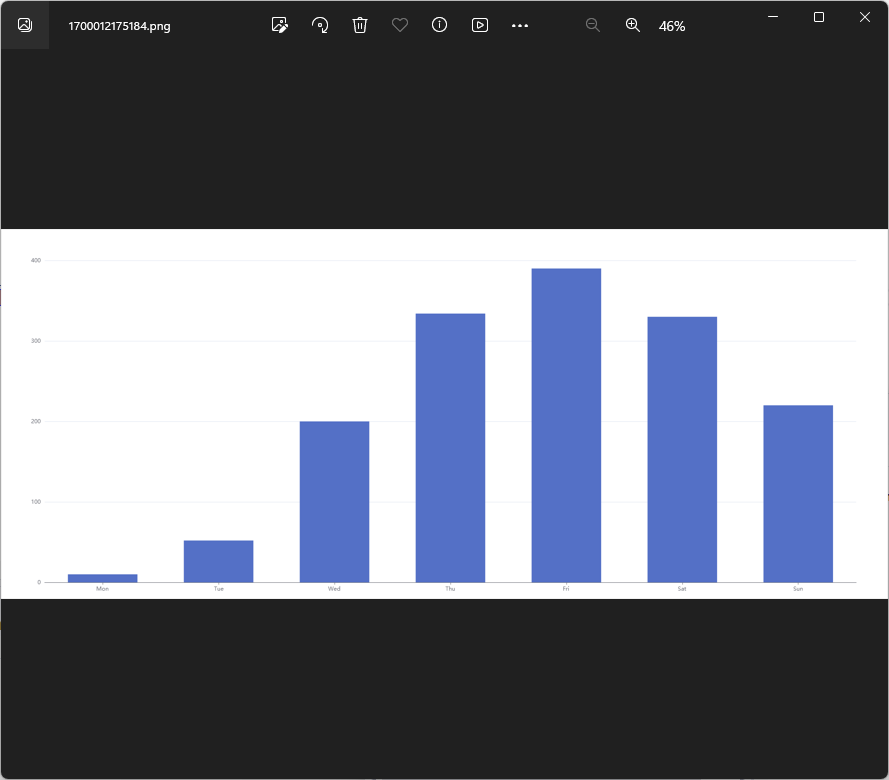
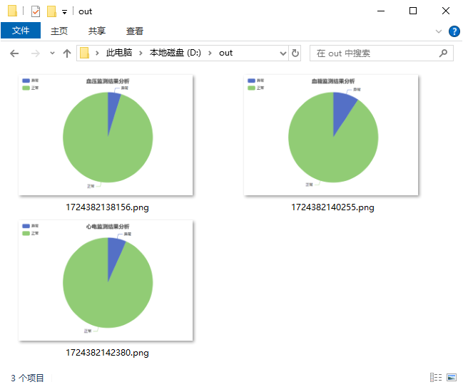

# EChartsGen

在后端使用ECharts库，将ECharts图表Png图像文件导出到本地磁盘



## 快速开始

1. 在项目中引用[EChartsGen]( https://www.nuget.org/packages/EChartsGen)

```
dotnet add package EChartsGen
```

2. 指定一个option用于生成Echarts

> option是一个json对象，用于配置图表的各个属性，从而定义图表的展示形式。详情请查看官网：https://echarts.apache.org/zh/option.html

```
Exporter exporter = new Exporter();
var pngPath = await exporter.ExportAsync(new EChartsGen.ExportOption() { ChartOptionPath = "D:/option.json", OutputPath="D:/out" });
```

或使用Option对象参数

```
Exporter exporter = new Exporter();

var title = "血压监测结果分析"; var passCount = 40; var failedCount = 2;
var pngPath = exporter.ExportAsync(new EChartsGen.ExportOption()
{
    Height = 400,
    Width = 580,
    ChartOption = new ChartOption()
    {
        title = new List<Title>()
        {
            new Title (){
            text=title, left="center"}
        },
        tooltip = new ToolTip(),
        legend = new Legend()
        {
            orient = OrientType.vertical,
            left = "left"
        },
        series = new object[]
        {
            new {
                name= "Access From",
                type="pie",
                data=new object[]
                    {
                        new  { value= failedCount, name="异常" },
                        new  { value= passCount, name="正常" },
                    }
            }
        }
    },
    OutputPath="D:/out"
})
```

查看结果：




## ExportOption 说明

* ChartOptionPath - Option的json文件路径
* ChartOption - Option的.Net对象
* Height - 图片高度
* Width - 图片宽度
* OutputPath - 图片文件的生成目录,若为空则默认生成至工作目录下`\libs\phantomjs-2.1.1-windows\tmp`

ChartOptionPath和ChartOption二选一，如果同时指定，优先使用ChartOptionPath。
图片的高度和宽度默认为1920*800，你可以根据实际情况调整。


## 示例

1. 运行单元测试
2. 使用文档模板生成工具将ECharts图形填充到Word文档示例，请前往[EChartsGen_DocTemplateTool_Sample](./EChartsGen_DocTemplateTool_Sample/)


## 更新内容

|  Date  |  Version   | Content                                                                                         |
| :----: | :--------: | :---------------------------------------------------------------------------------------------- |
| V0.1.0 | 2023-11-15  | 初始版本                                                                           
| V0.1.1 | 2024-8-22  | 修复phantomjs报错   
| V0.1.2 | 2024-8-23  | 添加OutputPath参数

## 已知问题


## 作者信息

作者：林小

邮箱：jevonsflash@qq.com


## License

The MIT License (MIT)
